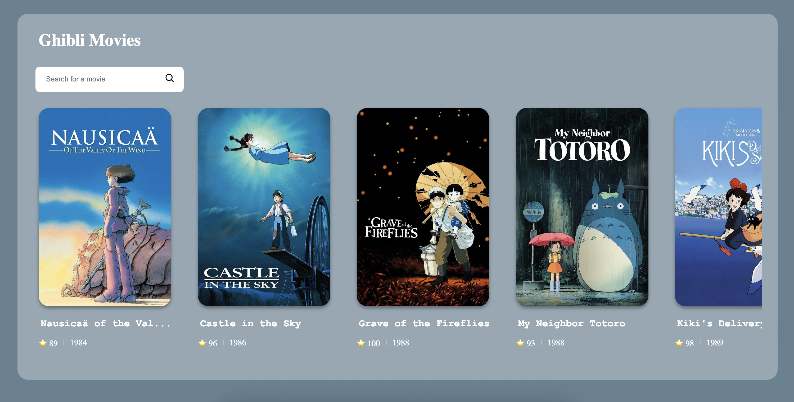

# 🎬 Ghibli Movies

A simple web app that displays movies from **Studio Ghibli**, one of the most beloved animation studios in the world.  
The application fetches data from the [Studio Ghibli API](https://ghibliapi.vercel.app/) and presents it in a clean and user-friendly interface.

🔗 **Live Demo:** [allghiblimovies.netlify.app](https://allghiblimovies.netlify.app/)

---

## ✨ Features

- 📜 List of Studio Ghibli movies  
- 🎥 Movie details including title, description, director, producer, release date, and more  
- 🔍 Simple and intuitive interface for exploring films  

---

## 🚀 Technologies

This project was built using:

- **React** – For building the user interface  
- **JavaScript (ES6+)** – Core language of the project  
- **CSS** – For styling and layout  
- **Studio Ghibli API** – Open API that provides data about the films  

---

## 📦 Installation

Clone the repository:

```bash
git clone https://github.com/aninhabort/ghibli-movies.git
```

Navigate into the project folder:

```bash
cd ghibli-movies
```

Install dependencies:

```bash
npm install
```

Run the project locally:

```bash
npm start
```

The app will be available at **[http://localhost:3000/](http://localhost:3000/)**.

---

## 📸 Preview



---

## 📚 API Reference

Data is fetched from the [Studio Ghibli API](https://ghibliapi.vercel.app/), which provides information such as:

* Movie title
* Original title
* Director
* Producer
* Release date
* Running time
* Description

---

## 🤝 Contributing

Contributions are welcome!
If you’d like to improve this project, feel free to **open an issue** or submit a **pull request**.
